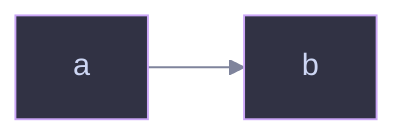

# A guide

The diagram follows the shared theme:

```mermaid
%%{init: {"theme": "base", "themeVariables": {
  "background": "#1e1e2e", "primaryColor": "#313244",
  "primaryTextColor": "#cdd6f4", "primaryBorderColor": "#cba6f7",
  "lineColor": "#7f849c", "secondaryColor": "#181825",
  "tertiaryColor": "#181825",
  "fontFamily": "JetBrainsMono Nerd Font, ui-monospace, monospace" }}}%%
flowchart LR
  A[a] --> B[b]
```

The commit is 82bca82b and the issue #290879; see [the colors](#color).
